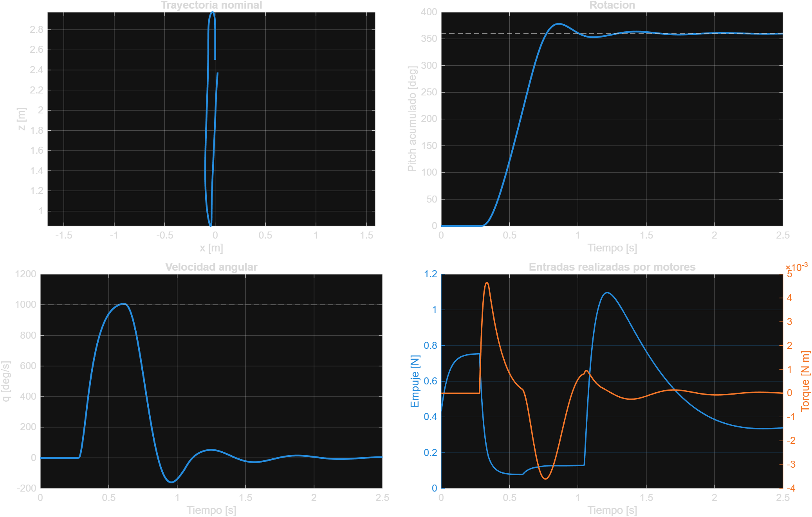
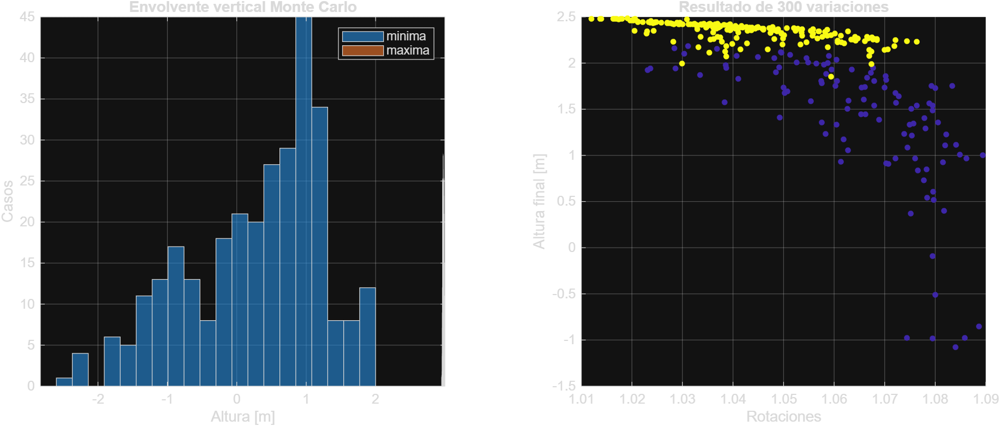

# Simulación en MATLAB de un backflip con Crazyflie

**Fecha:** 18 de septiembre de 2026  
**Alcance:** evaluación numérica; no se enviaron comandos a un dron.

## Resumen

Una simulación planar no lineal construida con los parámetros identificados del Crazyflie 2.1 Brushless completó un backflip nominal. Partiendo a 2.5 m, el modelo terminó a 2.376 m, con 0.19° de error de actitud, velocidad angular máxima de 1007.6°/s y 2.123 m de recorrido vertical total. La conclusión es que la maniobra es físicamente posible en el modelo publicado.

La robustez todavía es insuficiente para un ensayo real. En 300 corridas con incertidumbres tomadas del intervalo recomendado por Gräfe et al., 193 cumplieron todos los criterios (64.3%). El percentil 5 de altura mínima fue -1.457 m, lo que indica colisión con el suelo en una parte apreciable de los casos. Se requiere mejorar el controlador y validar parámetros del dron concreto antes de considerar hardware.

## Fuentes y datos empleados

1. Antal, Péni y Tóth, *Backflipping with Miniature Quadcopters by Gaussian Process Based Control and Planning* (2023): modelo planar, cinco fases de la maniobra y validación con Crazyflie 2.1. El artículo reporta `m = 28 g`, `Jyy = 1.4e-5 kg m²` y una maniobra optimizada con `U1 = U5 = 17.8 m/s²`, `t1 = 0.14 s`, `t3 = 0.20 s`, `t5 = 0.12 s`. [Artículo](https://arxiv.org/abs/2209.14652)
2. Gräfe et al., *How to Model Your Crazyflie Brushless* (2026): `m = 44 g` con protectores, `Jyy = 3.6e-5 kg m²`, ancho `0.0707 m`, constante del motor `T = 0.05 s`, ganancia `K = 2900 rad/s` y polinomio medido de empuje. El artículo demuestra un backflip doble real con 1.8 m de movimiento vertical y frenado desde 1000°/s. [Artículo](https://arxiv.org/abs/2603.05944)

Se seleccionó el conjunto Brushless porque contiene dinámica del motor y curva de empuje medidas. Los valores del Crazyflie 2.1 convencional se conservaron como referencia experimental, pero no se mezclaron en la planta nominal.

## Modelo implementado

El estado es `[x, z, vx, vz, theta, q, Omega1..Omega4]`. Se integraron, a 0.5 ms:

```text
x_ddot     = -(F/m) sin(theta)
z_ddot     =  (F/m) cos(theta) - g
theta_ddot = tau_y/Jyy
Omega_dot  = (K u - Omega)/T
```

El empuje individual usa el polinomio identificado en el paper Brushless:

```text
Fi = -0.23 r³ + 0.562 r² - 0.043 r,  r = Omega/2900
```

El controlador híbrido tiene cuatro estados: impulso vertical, aceleración angular, frenado hacia `2*pi` y recuperación de actitud/altura. La asignación de motores genera torque de cabeceo con los pares 1+4 y 2+3. Es un controlador reproducible creado para esta evaluación; no es la red neuronal del paper ni el controlador geométrico con proceso gaussiano.

## Criterio de éxito

Una corrida cuenta como exitosa cuando:

- alcanza al menos 0.98 rotaciones;
- no cruza `z = 0`;
- termina con error angular menor que 15°;
- termina con velocidad angular menor que 80°/s.

## Resultado nominal

| Métrica | Resultado |
|---|---:|
| Backflip completado | Sí |
| Rotación máxima acumulada | 1.0503 vueltas |
| Error angular final | 0.19° |
| Velocidad angular máxima | 1007.6°/s |
| Altura inicial | 2.500 m |
| Altura máxima | 2.974 m |
| Altura mínima | 0.851 m |
| Altura final | 2.376 m |
| Recorrido vertical máximo | 2.123 m |
| Intervalo horizontal | -0.099 a 0.025 m |
| Empuje colectivo máximo | 1.096 N |



El pico de velocidad coincide aproximadamente con los 1000°/s documentados para el Brushless. La excursión vertical calculada es 0.323 m mayor que los 1.8 m reportados para el backflip doble del paper, señal de que este controlador sencillo deja margen de mejora.

## Incertidumbre y robustez

Se ejecutaron 300 casos con semilla fija. Se varió masa ±10% e inercia, constante temporal del motor, escala de empuje y escala de torque ±20%, siguiendo los intervalos de aleatorización de dominio recomendados por Gräfe et al.

| Métrica | Resultado |
|---|---:|
| Casos exitosos | 193/300 |
| Tasa de éxito | 64.3% |
| Mediana de altura mínima | 0.464 m |
| Percentil 5 de altura mínima | -1.457 m |
| Percentil 95 de altura mínima | 1.627 m |
| Mediana de altura final | 2.260 m |
| Percentil 95 del error angular final | 1.83° |



La actitud final es buena en casi todos los casos; la pérdida de altura explica la mayoría de fallos. Esto concuerda con la observación del paper Brushless de que la dinámica vertical es más sensible que la rotacional ante variaciones de masa y empuje.

## Conclusión

Los datos publicados y esta simulación apoyan que un Crazyflie Brushless puede realizar un backflip. El caso nominal completa la rotación, frena y recupera una actitud nivelada. La tasa Monte Carlo de 64.3% impide interpretar el resultado como un controlador listo para vuelo.

Antes de una prueba física harían falta, como mínimo, identificación del dron concreto, estimación conservadora de espacio libre, simulación con el estimador y retardos del firmware, saturaciones verificadas en el hardware, recuperación robusta de altura y ensayos progresivos protegidos. Esta simulación no valida que el controlador actual del repositorio pueda ejecutar la maniobra.

## Reproducción

Desde la raíz del repositorio, con MATLAB R2026a:

```powershell
matlab -batch "run('thesis/simulations/backflip/simular_backflip_crazyflie.m')"
```

El script fuente está en `thesis/simulations/backflip/simular_backflip_crazyflie.m`. Los CSV se generan en `results/data/backflip/2026-09-18/` y las gráficas en `results/graphs/backflip/2026-09-18/`.

## Limitaciones

- El movimiento se restringe al plano `x-z` y al eje de cabeceo.
- No se modelan aerodinámica, flexión, contacto, batería, sensores, estimador ni retrasos de radio.
- La inversión del polinomio de empuje supone motores iguales.
- El Monte Carlo explora incertidumbre paramétrica, pero no ráfagas, fallos de medición ni asimetrías persistentes.
- El éxito numérico no constituye autorización ni evidencia suficiente para probar la maniobra en hardware.
